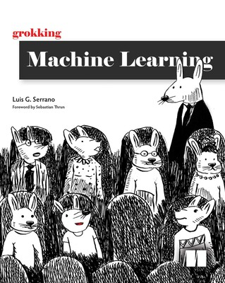

# Grokking Machine Learning Book Repository
This is the repo for the book "Grokking Machine Learning", available [here](https://www.manning.com/books/grokking-machine-learning).

Get it with a 40% discount code: **serranopc**

### Chapters:

1. What is machine learning?
2. Types of machine learning
3. Drawing a line close to our points: **Linear regression** [(code)](https://github.com/luisguiserrano/manning/tree/master/Chapter_3_Linear_Regression)
4. Optimizing the training process: **Underfitting**, **overfitting**, **testing**, and **regularization** [(code)](https://github.com/luisguiserrano/manning/tree/master/Chapter_4_Testing_Overfitting_Underfitting)
5. Using lines to split our points: **The perceptron algorithm** [(code)](https://github.com/luisguiserrano/manning/tree/master/Chapter_5_Perceptron_Algorithm)
6. A continuous approach to splitting points: **Logistic classifiers** [(code)](https://github.com/luisguiserrano/manning/tree/master/Chapter_6_Logistic_Regression)
7. How do you measure classification models?: **Accuracy** and its friends
8. Using probability to its maximum: The **Naive Bayes** model [(code)](https://github.com/luisguiserrano/manning/tree/master/Chapter_8_Naive_Bayes)
9. Splitting data by asking questions: **Decision trees** [(code)](https://github.com/luisguiserrano/manning/tree/master/Chapter_9_Decision_Trees)
10. Combining building blocks to gain more power: **Neural networks** [(code)](https://github.com/luisguiserrano/manning/tree/master/Chapter_10_Neural_Networks)
11. Finding boundaries with style: **Support vector machines** and the **kernel method** [(code)](https://github.com/luisguiserrano/manning/tree/master/Chapter_11_Support_Vector_Machines)
12. Combining models to maximize results: **Ensemble learning** [(code)](https://github.com/luisguiserrano/manning/tree/master/Chapter_12_Ensemble_Methods)
13. Putting it all in practice: A real life example of **data engineering** and **machine learning** [(code)](https://github.com/luisguiserrano/manning/tree/master/Chapter_13_End_to_end_example)
